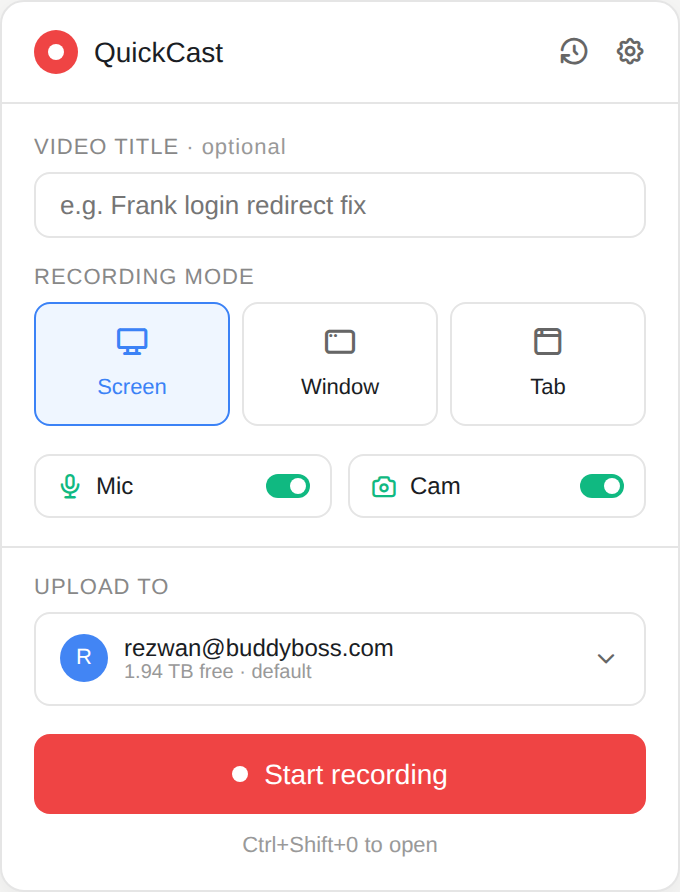
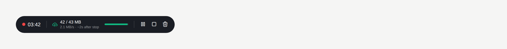
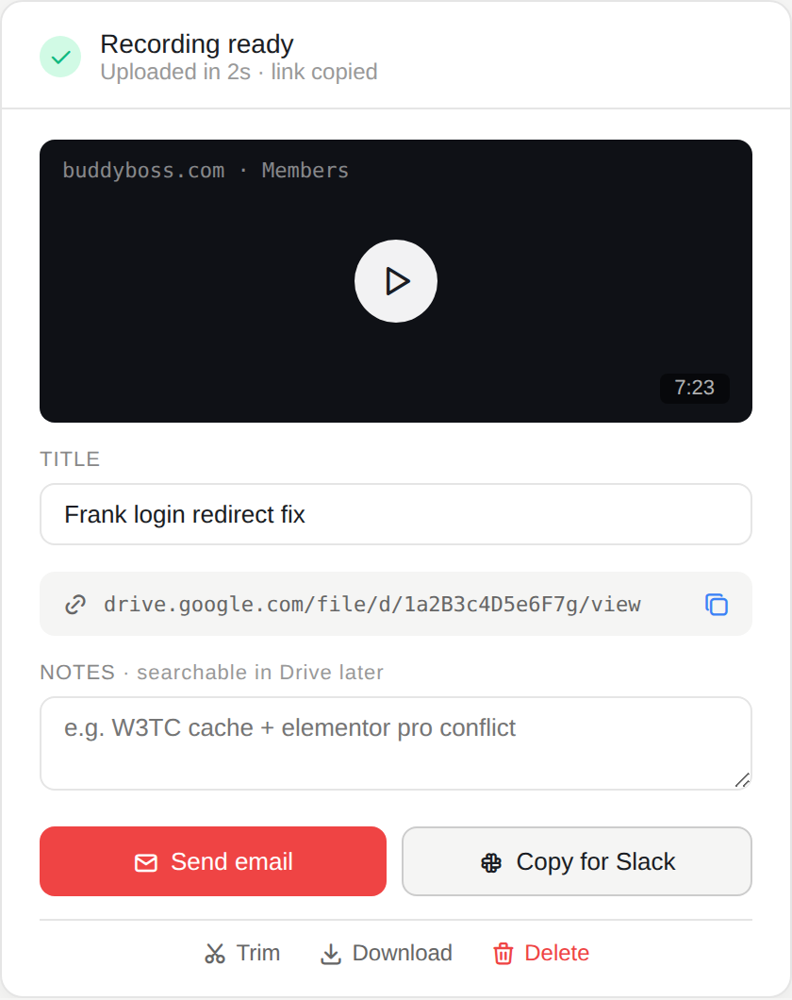
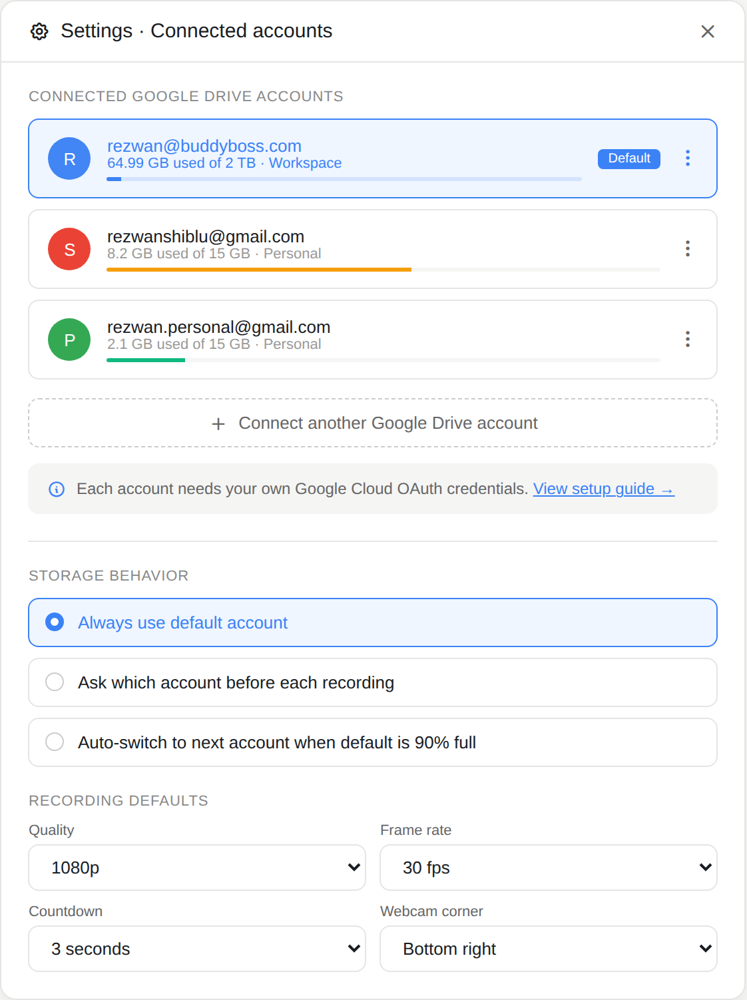
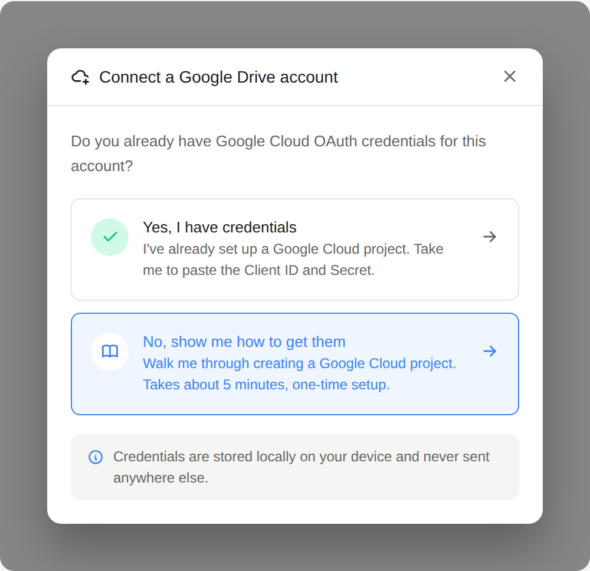
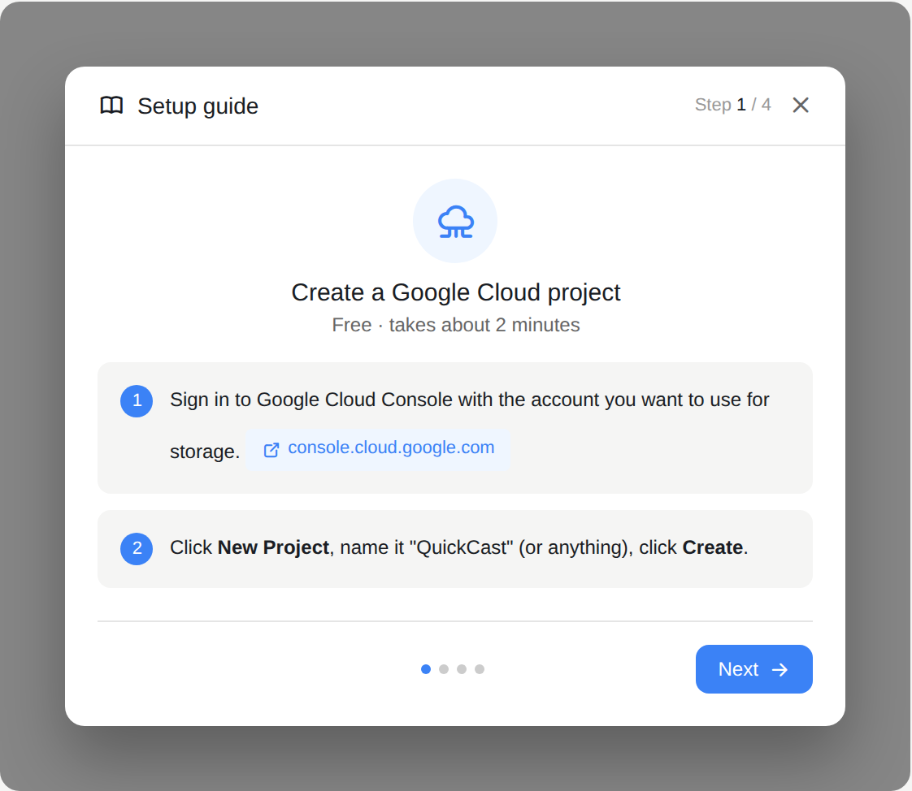
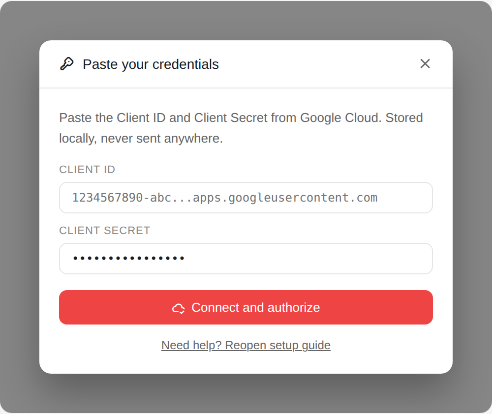

# QuickCast — Design

Visual and interaction reference for building the QuickCast UI. All screenshots live in `./screenshots/`.

---

## Design principles

- **Minimal, one primary action per screen.** Never make the user choose between multiple bold buttons.
- **Speed is the product.** Anything that adds friction between "I want to record" and "here's the link" is wrong.
- **Storage is visible but not intrusive.** User always knows which account they're uploading to, but doesn't need to think about it every time.
- **Nothing critical hidden behind menus.** Recording controls, upload progress, and the share link are always one glance away.
- **Fail safely.** Local IndexedDB copy exists during and after recording — the user never loses work due to a network hiccup.

## Visual language

- **Primary accent:** red `#ef4444` — used only for the record button and recording indicator. Never for anything else.
- **Interactive accent:** blue `#3b82f6` — for selected states, links, buttons that aren't the primary "record" action.
- **Success:** green `#10b981` — mic/cam on state, healthy upload, completion checkmark.
- **Warning:** amber `#f59e0b` — buffering, storage getting full (55%+).
- **Danger:** red `#ef4444` — errors, delete actions, storage nearly full (90%+).
- **Surface:** white `#ffffff`, secondary surface `#f5f5f4`, hairlines `#e5e5e5` (all at `0.5px`).
- **Text:** primary `#1a1d24`, secondary `#666`, muted `#999`.
- **Corners:** `8px` on buttons/inputs, `12px` on cards/modals, `24px` on the floating widget (pill shape).
- **Font:** system sans-serif stack (`-apple-system, BlinkMacSystemFont, "Segoe UI", Inter, sans-serif`).
- **Icons:** [Tabler Icons](https://tabler.io/icons) (outline variant), sized 14–18px in most places.

Dark mode ships in v2. All colors above have dark-mode equivalents but v1 targets light mode only for simplicity.

---

## Screen inventory

Seven screens make up the entire product surface.

### 1. Main popup

Opens when the user clicks the extension icon or presses `Ctrl+Shift+0` / `Cmd+Shift+0`. 340px wide.



- Header: brand mark + history icon (opens recent recordings) + settings icon
- Video title field (optional) — user types what the recording is about, or leaves blank
- Recording mode picker: **Screen** (default), Window, Tab — one is always selected
- Mic and Cam toggles — default ON, tap to disable
- Upload destination — shows current default account, storage remaining. Tap to switch accounts. If only one account is connected, still shown but non-interactive.
- **Start recording** button (red, primary, full-width) — clicking triggers Chrome's screen picker (or window/tab picker based on mode), then recording begins immediately
- Shortcut hint at the bottom for discoverability

### 2. Recording widget (floating)

Appears the moment recording starts. Draggable, always on top, sits at bottom-left by default.



- **Pulsing red dot + timer** (`MM:SS`, tabular numerals so digits don't jitter)
- **Upload status:** MB uploaded / total buffered, current upload speed, estimated wait after stop
- **Progress bar** — visual sync between recording and upload
- **Cloud icon color** encodes health:
  - Green: healthy, upload keeping pace
  - Amber: buffering, upload slightly behind
  - Red: slow, network struggling
  - Green check: caught up (usually shown when paused)
- Icons on the right: **Pause / Resume**, **Stop**, **Cancel/Delete**
- Widget is compact (~370px wide), single row, non-blocking

Webcam bubble (if enabled) is separate — a draggable circular video element in a corner.

### 3. Share screen

Appears the moment the user hits Stop. This is the payoff moment.



- Header: green check + "Recording ready" + upload time + "link copied" confirmation
- Video preview thumbnail with play button and duration
- Editable title field (pre-filled from what the user typed pre-recording, or auto-generated timestamp if blank)
- **Drive share link row** — copyable, monospace font for URL clarity, auto-copied to clipboard on screen open
- Notes field — free text, gets written to Drive file description (searchable in Drive later)
- **Primary action:** Send email (red, opens default mail client with the link)
- **Secondary action:** Copy for Slack (grey)
- Bottom row of tertiary actions: Trim, Download, Delete

### 4. Settings

Full settings page with account management as the primary section.



- **Connected Google Drive accounts** — each row shows avatar, email, storage used/total, workspace type (Workspace / Personal), and a horizontal storage bar
  - Default account is highlighted with blue accent border + blue "Default" badge
  - Storage bar color: green (<50%), amber (50–89%), red (≥90%)
  - Three-dot menu per row: set as default, disconnect, view in Drive
- **Connect another Google Drive account** — dashed button, opens the connect modal (screen 5)
- Info box with link to setup guide
- **Storage behavior** radio group: use default / ask each time / auto-switch when full
- **Recording defaults** grid: quality (1080p/720p/480p), frame rate (24/30/60 fps), webcam corner

### 5. Connect account modal

Opens when the user clicks "Connect another Google Drive account". Sits on top of Settings with a dimmed backdrop.



- Asks: do you already have Google Cloud OAuth credentials for this account?
- **Yes** → jumps to Paste credentials modal (screen 7)
- **No, show me how** (recommended, highlighted blue) → jumps to Setup guide (screen 6)
- First-time users almost always pick "No"; returning users adding a 2nd or 3rd account pick "Yes"

### 6. Setup guide modal

4-step wizard for creating a Google Cloud project. Opens on top of Settings (dimmed backdrop).



- Header shows step count (e.g. "Step 1 / 4") and close button
- Each step has: icon + title + estimated time, then numbered sub-steps
- Steps are:
  1. **Create a Google Cloud project** — sign in to Cloud Console, create project
  2. **Enable Google Drive API** — via APIs and Services → Library
  3. **Configure OAuth consent** — External, fill app name, add test users
  4. **Create OAuth credentials** — Chrome Extension type, using QuickCast's extension ID (which the guide displays for the user to copy)
- Footer: Back button (hidden on step 1), progress dots, Next button
- On step 4 completion, the Next button becomes "Paste credentials" and opens screen 7

### 7. Paste credentials modal

Final step of the connection flow. Opens on top of Settings.



- Two fields: Client ID (plain text, monospace), Client Secret (password field, monospace)
- **Connect and authorize** button (red primary) — validates credentials, then triggers Chrome's native OAuth popup for the user to pick the Google account and grant Drive scopes
- "Reopen setup guide" link at the bottom in case user gets stuck

---

## Interaction flows

### First-time user

1. Install extension → click icon → main popup opens
2. Popup shows an empty state: "Connect a Google Drive account to start" with a Connect button
3. Connect button → Connect modal (screen 5) → user picks "No, show me how" → Setup guide (screen 6)
4. User walks through 4 steps → clicks "Paste credentials" on step 4 → Paste modal (screen 7)
5. User pastes credentials → Chrome OAuth popup → user grants access → account appears in Settings
6. User is returned to main popup (screen 1), now with their account connected → can record

### Recording a video (main flow)

1. User clicks extension icon or presses `Ctrl+Shift+0` / `Cmd+Shift+0`
2. Main popup opens (screen 1)
3. User optionally types a title, adjusts mic/cam, clicks **Start recording**
4. Chrome native screen/window/tab picker appears
5. User picks a source → recording begins immediately
6. Popup closes automatically. Recording widget (screen 2) appears at bottom-left
7. Chunks stream to Drive continuously in the background
8. User does whatever they're demonstrating; talks over mic
9. User clicks **Stop** on the widget
10. Share screen (screen 3) appears within ~2 seconds. Link is already in clipboard.
11. User pastes link into email/Slack, or clicks "Send email" for a pre-filled draft

### Adding a second Drive account (returning user)

1. Settings → Connect another Google Drive account → Connect modal (screen 5)
2. User picks "Yes, I have credentials" → Paste modal (screen 7) directly (skips guide)
3. Pastes credentials → OAuth popup → new account added to the list

### Recovering from network drop during recording

1. Widget cloud icon turns amber, then red if disconnection continues
2. Recording continues — chunks accumulate in IndexedDB
3. When network returns: chunks upload in order from where they left off (Drive's resumable upload session is preserved)
4. Widget cloud icon returns to green when caught up
5. If Drive session is fully lost: on Stop, share screen shows "Upload failed — retry" with local copy still available

---

## Component notes for implementation

- **Popup** is a WXT popup entrypoint. Fixed width 340px, height grows to content.
- **Recording widget** is injected as a content script (or an offscreen document rendering an overlay). Draggable, position saved in `chrome.storage.local`.
- **Share screen** could be a new tab page or a full-screen popup — recommend new tab page so the user can leave it open while composing an email.
- **Settings** opens as a new tab (`chrome-extension://.../settings.html`) rather than a popup so it can be wider and scrollable.
- **All modals** (Connect, Setup guide, Paste credentials) are React components rendered inside Settings' page, not separate windows.

---

## Rendering the screenshots yourself

The screenshots in `./screenshots/` were generated from `./mockups.html` using Playwright. To re-render after edits:

```bash
npm install @tabler/icons-webfont
python3 snapshot.py
```

`mockups.html` is only a design reference. It is not part of the extension build; delete it or move it to a `design/` folder before shipping.
